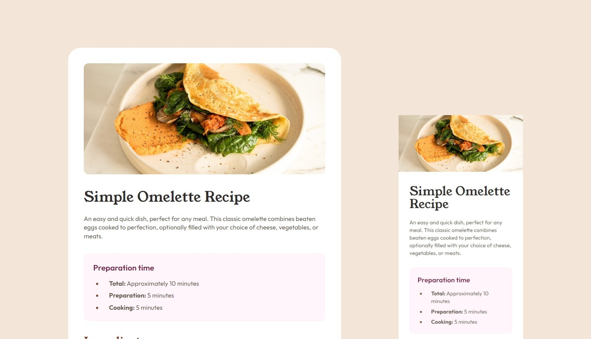

# Frontend Mentor - Recipe page solution

This is a solution to the [Recipe page challenge on Frontend Mentor](https://www.frontendmentor.io/challenges/recipe-page-KiTsR8QQKm). Frontend Mentor challenges help you improve your coding skills by building realistic projects.

## Table of contents

- [Overview](#overview)
  - [Screenshot](#screenshot)
  - [Links](#links)
  - [Built with](#built-with)

## Overview

### Screenshot

### Links

- Live Site: [https://dan9h.github.io/fm-recipe-page/](https://dan9h.github.io/fm-recipe-page/)
- Repository: [https://github.com/dan9h/fm-recipe-page/](https://github.com/dan9h/fm-recipe-page/)

### Built with

- Semantic HTML5 markup
- CSS custom properties
- Mobile-first workflow
- Responsive web design
